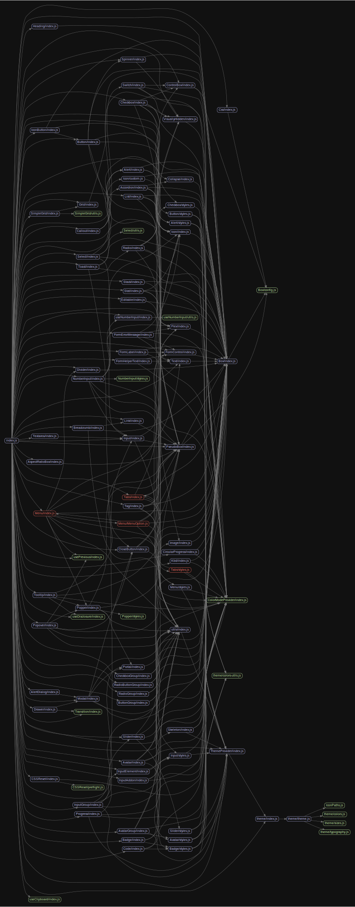

# 源码分析

## 文件结构

``` bash
/Users/liufang/openSource/FunnyLiu/chakra-ui/packages/chakra-ui
├── CHANGELOG.md
├── README.md
├── dist
|  ├── Accordion
|  |  ├── index.d.ts
|  |  ├── index.js
|  |  └── package.json
|  ├── Alert
|  |  ├── index.d.ts
|  |  ├── index.js
|  |  ├── package.json
|  |  └── styles.js
|  ├── AlertDialog
|  |  ├── index.d.ts
|  |  ├── index.js
|  |  └── package.json
|  ├── AspectRatioBox
|  |  ├── index.d.ts
|  |  ├── index.js
|  |  └── package.json
|  ├── Avatar
|  |  ├── index.d.ts
|  |  ├── index.js
|  |  ├── package.json
|  |  └── styles.js
|  ├── AvatarGroup
|  |  ├── index.d.ts
|  |  ├── index.js
|  |  └── package.json
|  ├── Badge
|  |  ├── index.d.ts
|  |  ├── index.js
|  |  ├── package.json
|  |  └── styles.js
|  ├── Box
|  |  ├── config.js
|  |  ├── index.d.ts
|  |  ├── index.js
|  |  └── package.json
|  ├── Breadcrumb
|  |  ├── index.d.ts
|  |  ├── index.js
|  |  └── package.json
|  ├── Button
|  |  ├── index.d.ts
|  |  ├── index.js
|  |  ├── package.json
|  |  └── styles.js
|  ├── ButtonGroup
|  |  ├── index.d.ts
|  |  ├── index.js
|  |  └── package.json
|  ├── CSSReset
|  |  ├── index.d.ts
|  |  ├── index.js
|  |  ├── package.json
|  |  └── preflight.js
|  ├── Callout
|  |  ├── index.d.ts
|  |  ├── index.js
|  |  └── package.json
|  ├── Checkbox
|  |  ├── index.d.ts
|  |  ├── index.js
|  |  ├── package.json
|  |  └── styles.js
|  ├── CheckboxGroup
|  |  ├── index.d.ts
|  |  ├── index.js
|  |  └── package.json
|  ├── CircularProgress
|  |  ├── index.d.ts
|  |  ├── index.js
|  |  └── package.json
|  ├── CloseButton
|  |  ├── index.d.ts
|  |  ├── index.js
|  |  └── package.json
|  ├── Code
|  |  ├── index.d.ts
|  |  ├── index.js
|  |  └── package.json
|  ├── Collapse
|  |  ├── index.d.ts
|  |  ├── index.js
|  |  └── package.json
|  ├── ColorModeProvider
|  |  ├── index.d.ts
|  |  ├── index.js
|  |  └── package.json
|  ├── ControlBox
|  |  ├── index.d.ts
|  |  ├── index.js
|  |  └── package.json
|  ├── Css
|  |  ├── index.d.ts
|  |  ├── index.js
|  |  └── package.json
|  ├── Divider
|  |  ├── index.d.ts
|  |  ├── index.js
|  |  └── package.json
|  ├── Drawer
|  |  ├── components.js
|  |  ├── index.d.ts
|  |  ├── index.js
|  |  └── package.json
|  ├── Editable
|  |  ├── index.d.ts
|  |  ├── index.js
|  |  └── package.json
|  ├── Flex
|  |  ├── index.d.ts
|  |  ├── index.js
|  |  └── package.json
|  ├── FormControl
|  |  ├── index.d.ts
|  |  ├── index.js
|  |  └── package.json
|  ├── FormErrorMessage
|  |  ├── index.d.ts
|  |  ├── index.js
|  |  └── package.json
|  ├── FormHelperText
|  |  ├── index.d.ts
|  |  ├── index.js
|  |  └── package.json
|  ├── FormLabel
|  |  ├── index.d.ts
|  |  ├── index.js
|  |  └── package.json
|  ├── Grid
|  |  ├── index.d.ts
|  |  ├── index.js
|  |  └── package.json
|  ├── Heading
|  |  ├── index.d.ts
|  |  ├── index.js
|  |  └── package.json
|  ├── Icon
|  |  ├── custom.js
|  |  ├── index.d.ts
|  |  ├── index.js
|  |  └── package.json
|  ├── IconButton
|  |  ├── index.d.ts
|  |  ├── index.js
|  |  └── package.json
|  ├── IconPaths.js
|  ├── Image
|  |  ├── index.d.ts
|  |  ├── index.js
|  |  └── package.json
|  ├── Input
|  |  ├── index.d.ts
|  |  ├── index.js
|  |  ├── package.json
|  |  └── styles.js
|  ├── InputAddon
|  |  ├── index.d.ts
|  |  ├── index.js
|  |  └── package.json
|  ├── InputElement
|  |  ├── index.d.ts
|  |  ├── index.js
|  |  └── package.json
|  ├── InputGroup
|  |  ├── index.d.ts
|  |  ├── index.js
|  |  └── package.json
|  ├── Kbd
|  |  ├── index.d.ts
|  |  ├── index.js
|  |  └── package.json
|  ├── Link
|  |  ├── index.d.ts
|  |  ├── index.js
|  |  └── package.json
|  ├── List
|  |  ├── index.d.ts
|  |  ├── index.js
|  |  └── package.json
|  ├── Menu
|  |  ├── MenuOption.d.ts
|  |  ├── MenuOption.js
|  |  ├── index.d.ts
|  |  ├── index.js
|  |  ├── package.json
|  |  └── styles.js
|  ├── Modal
|  |  ├── components.js
|  |  ├── index.d.ts
|  |  ├── index.js
|  |  └── package.json
|  ├── NumberInput
|  |  ├── index.d.ts
|  |  ├── index.js
|  |  ├── package.json
|  |  └── styles.js
|  ├── Popover
|  |  ├── index.d.ts
|  |  ├── index.js
|  |  └── package.json
|  ├── Popper
|  |  ├── index.d.ts
|  |  ├── index.js
|  |  ├── package.json
|  |  └── styles.js
|  ├── Portal
|  |  ├── index.d.ts
|  |  ├── index.js
|  |  └── package.json
|  ├── Progress
|  |  ├── index.d.ts
|  |  ├── index.js
|  |  └── package.json
|  ├── PseudoBox
|  |  ├── index.d.ts
|  |  ├── index.js
|  |  └── package.json
|  ├── README.md
|  ├── Radio
|  |  ├── index.d.ts
|  |  ├── index.js
|  |  └── package.json
|  ├── RadioButtonGroup
|  |  ├── index.d.ts
|  |  ├── index.js
|  |  └── package.json
|  ├── RadioGroup
|  |  ├── index.d.ts
|  |  ├── index.js
|  |  └── package.json
|  ├── Select
|  |  ├── index.d.ts
|  |  ├── index.js
|  |  ├── package.json
|  |  └── utils.js
|  ├── SimpleGrid
|  |  ├── index.d.ts
|  |  ├── index.js
|  |  ├── package.json
|  |  └── utils.js
|  ├── Slider
|  |  ├── index.d.ts
|  |  ├── index.js
|  |  ├── package.json
|  |  └── styles.js
|  ├── Spinner
|  |  ├── index.d.ts
|  |  ├── index.js
|  |  └── package.json
|  ├── Stack
|  |  ├── index.d.ts
|  |  ├── index.js
|  |  └── package.json
|  ├── Stat
|  |  ├── index.d.ts
|  |  ├── index.js
|  |  └── package.json
|  ├── Switch
|  |  ├── index.d.ts
|  |  ├── index.js
|  |  └── package.json
|  ├── Tabs
|  |  ├── index.d.ts
|  |  ├── index.js
|  |  ├── package.json
|  |  └── styles.js
|  ├── Tag
|  |  ├── index.d.ts
|  |  ├── index.js
|  |  └── package.json
|  ├── Text
|  |  ├── index.d.ts
|  |  ├── index.js
|  |  └── package.json
|  ├── Textarea
|  |  ├── index.d.ts
|  |  ├── index.js
|  |  └── package.json
|  ├── ThemeProvider
|  |  ├── index.d.ts
|  |  ├── index.js
|  |  └── package.json
|  ├── Toast
|  |  ├── index.d.ts
|  |  ├── index.js
|  |  └── package.json
|  ├── Tooltip
|  |  ├── index.d.ts
|  |  ├── index.js
|  |  └── package.json
|  ├── Transition
|  |  ├── index.d.ts
|  |  ├── index.js
|  |  └── package.json
|  ├── VisuallyHidden
|  |  ├── index.d.ts
|  |  ├── index.js
|  |  └── package.json
|  ├── common-types.d.ts
|  ├── es
|  |  ├── Accordion
|  |  |  └── index.js
|  |  ├── Alert
|  |  |  ├── index.js
|  |  |  └── styles.js
|  |  ├── AlertDialog
|  |  |  └── index.js
|  |  ├── AspectRatioBox
|  |  |  └── index.js
|  |  ├── Avatar
|  |  |  ├── index.js
|  |  |  └── styles.js
|  |  ├── AvatarGroup
|  |  |  └── index.js
|  |  ├── Badge
|  |  |  ├── index.js
|  |  |  └── styles.js
|  |  ├── Box
|  |  |  ├── config.js
|  |  |  └── index.js
|  |  ├── Breadcrumb
|  |  |  └── index.js
|  |  ├── Button
|  |  |  ├── index.js
|  |  |  └── styles.js
|  |  ├── ButtonGroup
|  |  |  └── index.js
|  |  ├── CSSReset
|  |  |  ├── index.js
|  |  |  └── preflight.js
|  |  ├── Callout
|  |  |  └── index.js
|  |  ├── Checkbox
|  |  |  ├── index.js
|  |  |  └── styles.js
|  |  ├── CheckboxGroup
|  |  |  └── index.js
|  |  ├── CircularProgress
|  |  |  └── index.js
|  |  ├── CloseButton
|  |  |  └── index.js
|  |  ├── Code
|  |  |  └── index.js
|  |  ├── Collapse
|  |  |  └── index.js
|  |  ├── ColorModeProvider
|  |  |  └── index.js
|  |  ├── ControlBox
|  |  |  └── index.js
|  |  ├── Css
|  |  |  └── index.js
|  |  ├── Divider
|  |  |  └── index.js
|  |  ├── Drawer
|  |  |  ├── components.js
|  |  |  └── index.js
|  |  ├── Editable
|  |  |  └── index.js
|  |  ├── Flex
|  |  |  └── index.js
|  |  ├── FormControl
|  |  |  └── index.js
|  |  ├── FormErrorMessage
|  |  |  └── index.js
|  |  ├── FormHelperText
|  |  |  └── index.js
|  |  ├── FormLabel
|  |  |  └── index.js
|  |  ├── Grid
|  |  |  └── index.js
|  |  ├── Heading
|  |  |  └── index.js
|  |  ├── Icon
|  |  |  ├── custom.js
|  |  |  └── index.js
|  |  ├── IconButton
|  |  |  └── index.js
|  |  ├── IconPaths.js
|  |  ├── Image
|  |  |  └── index.js
|  |  ├── Input
|  |  |  ├── index.js
|  |  |  └── styles.js
|  |  ├── InputAddon
|  |  |  └── index.js
|  |  ├── InputElement
|  |  |  └── index.js
|  |  ├── InputGroup
|  |  |  └── index.js
|  |  ├── Kbd
|  |  |  └── index.js
|  |  ├── Link
|  |  |  └── index.js
|  |  ├── List
|  |  |  └── index.js
|  |  ├── Menu
|  |  |  ├── MenuOption.js
|  |  |  ├── index.js
|  |  |  └── styles.js
|  |  ├── Modal
|  |  |  ├── components.js
|  |  |  └── index.js
|  |  ├── NumberInput
|  |  |  ├── index.js
|  |  |  └── styles.js
|  |  ├── Popover
|  |  |  └── index.js
|  |  ├── Popper
|  |  |  ├── index.js
|  |  |  └── styles.js
|  |  ├── Portal
|  |  |  └── index.js
|  |  ├── Progress
|  |  |  └── index.js
|  |  ├── PseudoBox
|  |  |  └── index.js
|  |  ├── Radio
|  |  |  └── index.js
|  |  ├── RadioButtonGroup
|  |  |  └── index.js
|  |  ├── RadioGroup
|  |  |  └── index.js
|  |  ├── Select
|  |  |  ├── index.js
|  |  |  └── utils.js
|  |  ├── SimpleGrid
|  |  |  ├── index.js
|  |  |  └── utils.js
|  |  ├── Slider
|  |  |  ├── index.js
|  |  |  └── styles.js
|  |  ├── Spinner
|  |  |  └── index.js
|  |  ├── Stack
|  |  |  └── index.js
|  |  ├── Stat
|  |  |  └── index.js
|  |  ├── Switch
|  |  |  └── index.js
|  |  ├── Tabs
|  |  |  ├── index.js
|  |  |  └── styles.js
|  |  ├── Tag
|  |  |  └── index.js
|  |  ├── Text
|  |  |  └── index.js
|  |  ├── Textarea
|  |  |  └── index.js
|  |  ├── ThemeProvider
|  |  |  └── index.js
|  |  ├── Toast
|  |  |  └── index.js
|  |  ├── Tooltip
|  |  |  └── index.js
|  |  ├── Transition
|  |  |  └── index.js
|  |  ├── VisuallyHidden
|  |  |  └── index.js
|  |  ├── index.js
|  |  ├── theme
|  |  |  ├── colors-utils.js
|  |  |  ├── colors.js
|  |  |  ├── index.js
|  |  |  ├── sizes.js
|  |  |  ├── theme.js
|  |  |  └── typography.js
|  |  ├── useClipboard
|  |  |  └── index.js
|  |  ├── useDisclosure
|  |  |  └── index.js
|  |  ├── useNumberInput
|  |  |  ├── index.js
|  |  |  └── utils.js
|  |  ├── usePrevious
|  |  |  └── index.js
|  |  └── utils
|  |     └── index.js
|  ├── index.d.ts
|  ├── index.js
|  ├── package.json
|  ├── theme
|  |  ├── colors-utils.js
|  |  ├── colors.js
|  |  ├── icons.d.ts
|  |  ├── index.d.ts
|  |  ├── index.js
|  |  ├── package.json
|  |  ├── sizes.js
|  |  ├── theme.js
|  |  └── typography.js
|  ├── useClipboard
|  |  ├── index.d.ts
|  |  ├── index.js
|  |  └── package.json
|  ├── useDisclosure
|  |  ├── index.d.ts
|  |  ├── index.js
|  |  └── package.json
|  ├── useNumberInput
|  |  ├── index.d.ts
|  |  ├── index.js
|  |  ├── package.json
|  |  └── utils.js
|  ├── usePrevious
|  |  ├── index.d.ts
|  |  ├── index.js
|  |  └── package.json
|  └── utils
|     ├── index.d.ts
|     ├── index.js
|     └── package.json
├── package.json
├── rollup.config.js
├── src
|  ├── Accordion
|  |  ├── examples.js
|  |  ├── index.d.ts
|  |  └── index.js
|  ├── Alert
|  |  ├── examples.js
|  |  ├── index.d.ts
|  |  ├── index.js
|  |  └── styles.js
|  ├── AlertDialog
|  |  ├── examples.js
|  |  ├── index.d.ts
|  |  └── index.js
|  ├── AspectRatioBox
|  |  ├── examples.js
|  |  ├── index.d.ts
|  |  └── index.js
|  ├── Avatar
|  |  ├── examples.js
|  |  ├── index.d.ts
|  |  ├── index.js
|  |  └── styles.js
|  ├── AvatarGroup
|  |  ├── index.d.ts
|  |  └── index.js
|  ├── Badge
|  |  ├── examples.js
|  |  ├── index.d.ts
|  |  ├── index.js
|  |  └── styles.js
|  ├── Box
|  |  ├── config.js
|  |  ├── examples.js
|  |  ├── index.d.ts
|  |  └── index.js
|  ├── Breadcrumb
|  |  ├── examples.js
|  |  ├── index.d.ts
|  |  └── index.js
|  ├── Button
|  |  ├── examples.js
|  |  ├── index.d.ts
|  |  ├── index.js
|  |  └── styles.js
|  ├── ButtonGroup
|  |  ├── examples.js
|  |  ├── index.d.ts
|  |  └── index.js
|  ├── CSSReset
|  |  ├── index.d.ts
|  |  ├── index.js
|  |  └── preflight.js
|  ├── Callout
|  |  ├── index.d.ts
|  |  └── index.js
|  ├── Checkbox
|  |  ├── examples.js
|  |  ├── index.d.ts
|  |  ├── index.js
|  |  └── styles.js
|  ├── CheckboxGroup
|  |  ├── examples.js
|  |  ├── index.d.ts
|  |  └── index.js
|  ├── CircularProgress
|  |  ├── examples.js
|  |  ├── index.d.ts
|  |  └── index.js
|  ├── CloseButton
|  |  ├── examples.js
|  |  ├── index.d.ts
|  |  └── index.js
|  ├── Code
|  |  ├── examples.js
|  |  ├── index.d.ts
|  |  └── index.js
|  ├── Collapse
|  |  ├── examples.js
|  |  ├── index.d.ts
|  |  └── index.js
|  ├── ColorModeProvider
|  |  ├── index.d.ts
|  |  └── index.js
|  ├── ControlBox
|  |  ├── examples.js
|  |  ├── index.d.ts
|  |  └── index.js
|  ├── Css
|  |  ├── examples.js
|  |  ├── index.d.ts
|  |  └── index.js
|  ├── Divider
|  |  ├── examples.js
|  |  ├── index.d.ts
|  |  └── index.js
|  ├── Drawer
|  |  ├── components.js
|  |  ├── examples.js
|  |  ├── index.d.ts
|  |  └── index.js
|  ├── Editable
|  |  ├── examples.js
|  |  ├── index.d.ts
|  |  └── index.js
|  ├── Flex
|  |  ├── index.d.ts
|  |  └── index.js
|  ├── FormControl
|  |  ├── examples.js
|  |  ├── index.d.ts
|  |  └── index.js
|  ├── FormErrorMessage
|  |  ├── index.d.ts
|  |  └── index.js
|  ├── FormHelperText
|  |  ├── index.d.ts
|  |  └── index.js
|  ├── FormLabel
|  |  ├── index.d.ts
|  |  └── index.js
|  ├── Grid
|  |  ├── index.d.ts
|  |  └── index.js
|  ├── Heading
|  |  ├── examples.js
|  |  ├── index.d.ts
|  |  └── index.js
|  ├── Icon
|  |  ├── custom.js
|  |  ├── examples.js
|  |  ├── index.d.ts
|  |  └── index.js
|  ├── IconButton
|  |  ├── examples.js
|  |  ├── index.d.ts
|  |  └── index.js
|  ├── IconPaths.js
|  ├── Image
|  |  ├── examples.js
|  |  ├── index.d.ts
|  |  └── index.js
|  ├── Input
|  |  ├── examples.js
|  |  ├── index.d.ts
|  |  ├── index.js
|  |  └── styles.js
|  ├── InputAddon
|  |  ├── index.d.ts
|  |  └── index.js
|  ├── InputElement
|  |  ├── index.d.ts
|  |  └── index.js
|  ├── InputGroup
|  |  ├── examples.js
|  |  ├── index.d.ts
|  |  └── index.js
|  ├── Kbd
|  |  ├── examples.js
|  |  ├── index.d.ts
|  |  └── index.js
|  ├── Link
|  |  ├── examples.js
|  |  ├── index.d.ts
|  |  └── index.js
|  ├── List
|  |  ├── examples.js
|  |  ├── index.d.ts
|  |  └── index.js
|  ├── Menu
|  |  ├── MenuOption.d.ts
|  |  ├── MenuOption.js
|  |  ├── examples.js
|  |  ├── index.d.ts
|  |  ├── index.js
|  |  └── styles.js
|  ├── Modal
|  |  ├── components.js
|  |  ├── examples.js
|  |  ├── index.d.ts
|  |  └── index.js
|  ├── NumberInput
|  |  ├── examples.js
|  |  ├── index.d.ts
|  |  ├── index.js
|  |  └── styles.js
|  ├── Popover
|  |  ├── examples.js
|  |  ├── index.d.ts
|  |  └── index.js
|  ├── Popper
|  |  ├── examples.js
|  |  ├── index.d.ts
|  |  ├── index.js
|  |  └── styles.js
|  ├── Portal
|  |  ├── index.d.ts
|  |  └── index.js
|  ├── Progress
|  |  ├── examples.js
|  |  ├── index.d.ts
|  |  └── index.js
|  ├── PseudoBox
|  |  ├── examples.js
|  |  ├── index.d.ts
|  |  └── index.js
|  ├── Radio
|  |  ├── examples.js
|  |  ├── index.d.ts
|  |  └── index.js
|  ├── RadioButtonGroup
|  |  ├── examples.js
|  |  ├── index.d.ts
|  |  └── index.js
|  ├── RadioGroup
|  |  ├── index.d.ts
|  |  └── index.js
|  ├── Select
|  |  ├── examples.js
|  |  ├── index.d.ts
|  |  ├── index.js
|  |  └── utils.js
|  ├── SimpleGrid
|  |  ├── examples.js
|  |  ├── index.d.ts
|  |  ├── index.js
|  |  └── utils.js
|  ├── Skeleton
|  |  ├── examples.js
|  |  ├── index.d.ts
|  |  └── index.js
|  ├── Slider
|  |  ├── examples.js
|  |  ├── index.d.ts
|  |  ├── index.js
|  |  └── styles.js
|  ├── Spinner
|  |  ├── examples.js
|  |  ├── index.d.ts
|  |  └── index.js
|  ├── Stack
|  |  ├── examples.js
|  |  ├── index.d.ts
|  |  └── index.js
|  ├── Stat
|  |  ├── examples.js
|  |  ├── index.d.ts
|  |  └── index.js
|  ├── Switch
|  |  ├── examples.js
|  |  ├── index.d.ts
|  |  └── index.js
|  ├── Tabs
|  |  ├── examples.js
|  |  ├── index.d.ts
|  |  ├── index.js
|  |  └── styles.js
|  ├── Tag
|  |  ├── examples.js
|  |  ├── index.d.ts
|  |  └── index.js
|  ├── Text
|  |  ├── index.d.ts
|  |  └── index.js
|  ├── Textarea
|  |  ├── examples.js
|  |  ├── index.d.ts
|  |  └── index.js
|  ├── ThemeProvider
|  |  ├── index.d.ts
|  |  └── index.js
|  ├── Toast
|  |  ├── examples.js
|  |  ├── index.d.ts
|  |  └── index.js
|  ├── Tooltip
|  |  ├── examples.js
|  |  ├── index.d.ts
|  |  └── index.js
|  ├── Transition
|  |  ├── index.d.ts
|  |  └── index.js
|  ├── VisuallyHidden
|  |  ├── index.d.ts
|  |  └── index.js
|  ├── common-types.d.ts
|  ├── index.d.ts
|  ├── index.js
|  ├── theme
|  |  ├── colors-utils.js
|  |  ├── colors.js
|  |  ├── examples.js
|  |  ├── icons.d.ts
|  |  ├── index.d.ts
|  |  ├── index.js
|  |  ├── sizes.js
|  |  ├── theme.js
|  |  └── typography.js
|  ├── useClipboard
|  |  ├── index.d.ts
|  |  └── index.js
|  ├── useDisclosure
|  |  ├── index.d.ts
|  |  └── index.js
|  ├── useNumberInput
|  |  ├── index.d.ts
|  |  ├── index.js
|  |  └── utils.js
|  ├── usePrevious
|  |  ├── index.d.ts
|  |  └── index.js
|  └── utils
|     ├── index.d.ts
|     └── index.js
├── tests
|  └── index-test.js
├── tsconfig.json
└── tslint.json

directory: 230 file: 604

ignored

```

## 外部模块依赖

请在： http://npm.broofa.com?q=@chakra-ui/core 查看

## 内部模块依赖


  